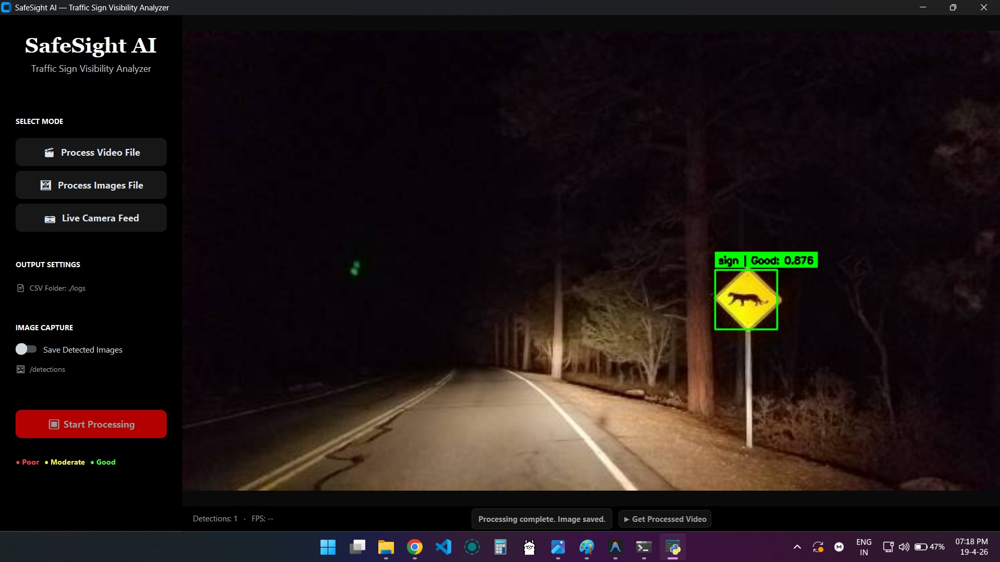
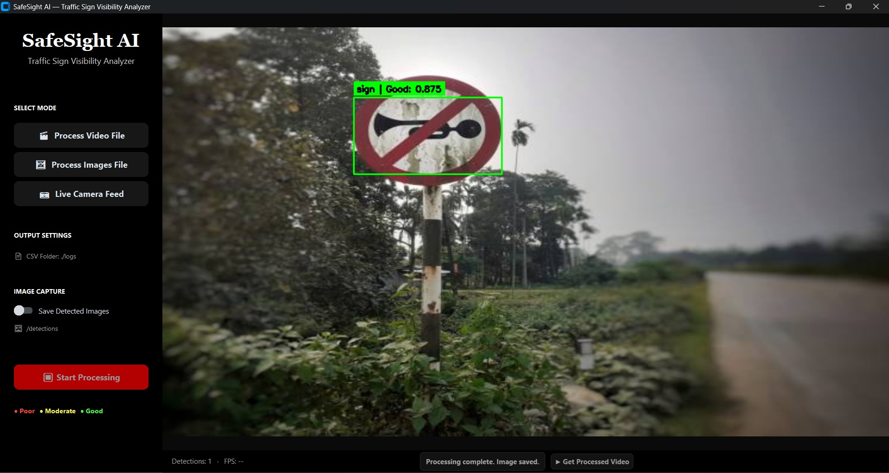
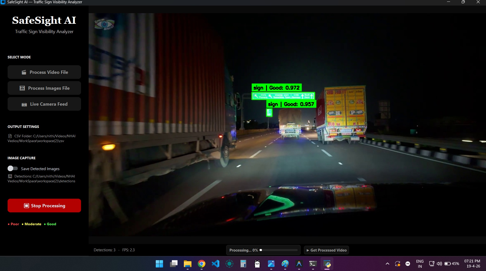
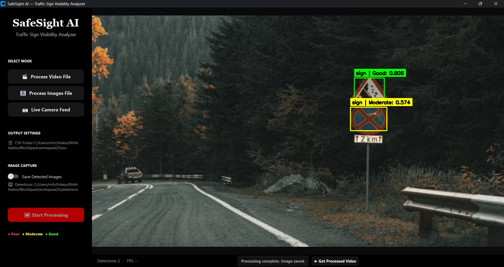

# 🚦 SafeSight AI — Traffic Sign Visibility Analyzer

> 🚀 AI-powered system for real-time highway safety monitoring and traffic sign visibility analysis

---

## ✨ Features

* 🎬 **Video Processing**
  Analyze recorded footage and export annotated videos

* 📷 **Live Camera Feed**
  Real-time detection with GPS logging

* 🖼 **Image Analysis**
  Batch processing for visibility scoring

* 📍 **GPS Integration**
  Logs coordinates of detected signs

* 📊 **CSV Logging**
  Generates structured reports

* 🌓 **Day/Night Optimization**
  CLAHE enhancement for low light

* 🎯 **Visibility Classification**
  🔴 Poor 🟡 Moderate 🟢 Good

---

## 🖼️ Visual Samples

<table align="center">
<tr>
<td align="center">
<br>
<b>Sample 1</b>
</td>
<td align="center">
<br>
<b>Sample 2</b>
</td>
</tr>

<tr>
<td align="center">
<br>
<b>Sample 3</b>
</td>
<td align="center">
<br>
<b>Sample 4</b>
</td>
</tr>
</table>


## ⚙️ Installation

```bash
git clone https://github.com/mpnithishpraba/SafeSight_AI-Traffic-Sign-Visibility-Analyzer.git
cd SafeSight_AI-Traffic-Sign-Visibility-Analyzer
pip install -r requirements.txt
```

---

## 🚀 Run

```bash
python app.py
```

---

## 📊 Model Performance

| Metric    | Value |
| --------- | ----- |
| Precision | 94.9% |
| Recall    | 75%   |
| mAP@50    | 85.3% |
| mAP@50-95 | 57%   |

✔ High precision
⚠️ Recall can improve for distant signs

---

## 📂 Project Structure

```bash
SafeSight-AI/
├── app.py
├── core/
├── models/
│   └── best.pt
├── utils/
├── logs/
├── detections/
└── samples/
```

---

## 🚀 Future Improvements

* Improve recall (small & far signs)
* Expand dataset (2000+ images)
* Edge deployment (Jetson / Raspberry Pi)
* Cloud dashboard
* Multi-class detection

---

## ⭐ Support

If you like this project:

👉 Star the repo
👉 Share it
👉 Contribute
